# Week 2 Assignment – Task 1: Responsive Company Website

**Intern:** Sunaina Dhali
**GitHub:** [@sunainadhali](https://github.com/sunainadhali)
**Organization:** WeIntern Pvt Ltd
**Program:** Full Stack Development Internship – Week 2

---

# Project Overview

**WanderWave** is a modern, responsive travel company website designed to inspire sustainable exploration and meaningful travel experiences.

The website promotes eco-friendly tourism, cultural immersion, wildlife encounters, and responsible travel through an engaging and visually appealing user experience. Built using semantic HTML5, CSS3, Flexbox, CSS Grid, animations, and JavaScript, the project demonstrates modern frontend development practices and responsive design principles.

---
🔗[Main Navigation Page](https://sunainadhali.github.io/week-2-assignment--weintern-/)
# Live Demo

🔗[view live](https://sunainadhali.github.io/week-2-assignment--weintern-/Responsive%20company%20website/index.html)


🔗 **GitHub Repository:**
https://github.com/sunainadhali/week-2-assignment--weintern-

---

# Objective

Build a fully responsive company website that:

* Uses semantic HTML5 structure
* Implements CSS Flexbox and Grid layouts
* Provides a responsive navigation experience
* Includes a validated contact form
* Maintains consistent branding and visual identity
* Delivers a professional user experience across devices

---

# Company Information

### Company Name

**WanderWave**

### Tagline

**Go. Wander. Repeat.**

### Industry

Sustainable Travel & Tourism

### Brand Theme

* Forest Green
* Clay
* Cream
* Terracotta

### Design Style

* Nature-inspired visuals
* Raw textures
* Organic aesthetics
* Handwritten typography
* Modern Gen-Z travel branding

---

# Features Implemented

## Responsive Navigation Bar

* Fixed navigation menu
* Mobile hamburger menu
* Smooth scrolling navigation
* Active section highlighting
* Sticky navigation behavior

---

## Hero Section

* Brand introduction
* Company tagline
* Call-to-action buttons
* Animated hero image
* Sustainable travel highlights

---

## Statistics Section

Interactive company metrics showcasing:

* Happy Travelers
* Destinations Covered
* Customer Satisfaction
* Sustainable Tours

Animated using JavaScript counter effects.

---

## About Section

### Company Story

Learn about WanderWave’s origins, mission, and commitment to responsible tourism.

### Why Choose Us

Highlights include:

* Slow Travel Experiences
* Cultural Exploration
* Ethical Wildlife Encounters

---

## Destinations Section

Featured travel destinations:

* Amazon Forest
* Swiss Alps
* Lake District

Interactive destination cards include hover animations and engaging visuals.

---

## Services Section

### Forest Escape

Explore dense forests through eco-tourism adventures.

### Mountain Retreat

Reconnect with nature through mountain experiences and hiking tours.

### Lakeside Adventure

Enjoy kayaking, camping, and waterside exploration.

### Desert Journey

Discover breathtaking desert landscapes and local traditions.

---

## Testimonials Section

Traveler reviews featuring:

* Five-star ratings
* Authentic travel experiences
* Customer satisfaction stories

---

## Call To Action Section

Encourages visitors to begin planning their next sustainable adventure.

---

## Contact Section

Interactive travel inquiry form containing:

* Full Name
* Email Address
* Phone Number
* Destination Selection
* Departure Date
* Return Date
* Travel Type
* Travel Preferences

### Form Validation

Implemented using JavaScript to ensure accurate user input.

---

## Footer Section

Includes:

* Company branding
* Quick navigation links
* Social media links
* Newsletter subscription field

---

# Technologies Used

## Frontend

* HTML5
* CSS3
* JavaScript (ES6)

## CSS Concepts

* Flexbox
* CSS Grid
* Responsive Design
* Media Queries
* Animations
* Transitions

## JavaScript Features

* Hamburger Navigation
* Form Validation
* Scroll Reveal Animations
* Animated Statistics Counter
* Active Navigation Highlighting
* Back To Top Button
* Newsletter Validation

---

# Project Structure

```text
week-2-assignment--weintern-/
│
├── index.html
│
├── css/
│   └── style.css
│
├── js/
│   └── script.js
│
├── assets/
│   └── images/
│       ├── hero.png
│       ├── about.png
│       ├── contact.png
│       ├── footer.png
│       ├── background.png
│       ├── destination1.jpg
│       ├── destination2.jpg
│       └── destination3.jpg
│
├── screenshots/
│
└── README.md
```

---

# Responsive Design

The website has been optimized for:

### Desktop

* 1440px+
* 1200px+

### Tablet

* 768px – 1024px

### Mobile

* 320px – 767px

---

# Screenshots

| Section       | Screenshot     |
| ------------- | -------------- |
| Home Page     | 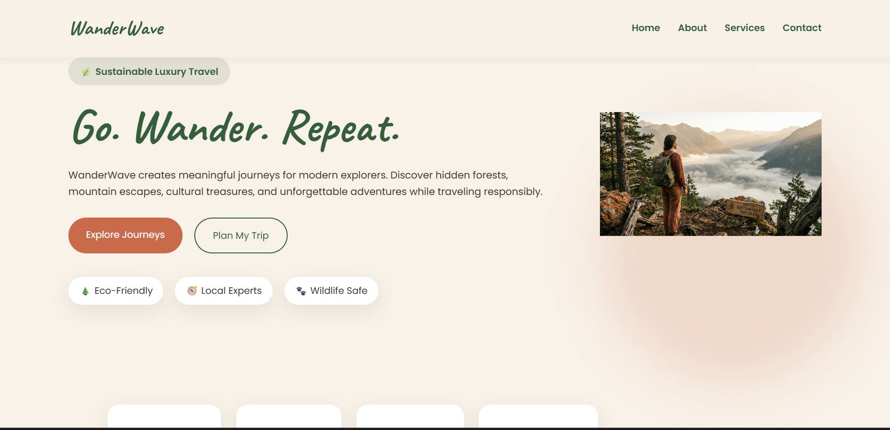 |
| Home Page     | 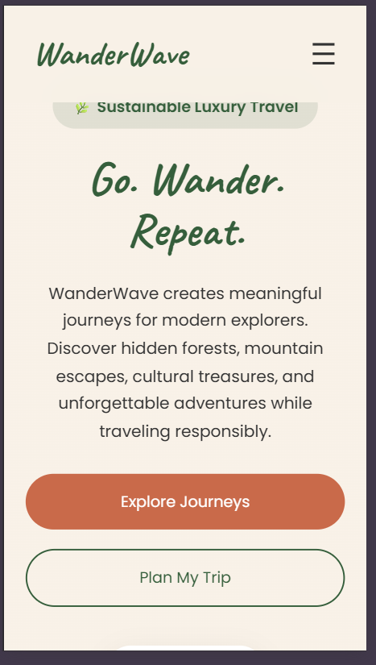 |
| Home Page     | 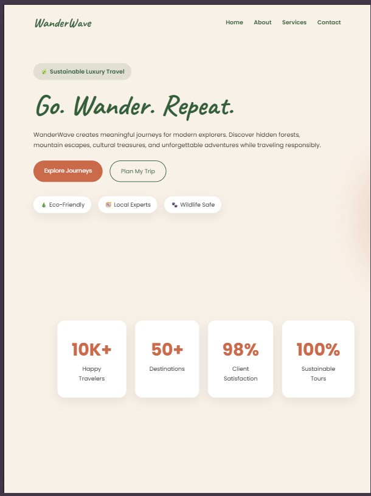 |
| About Section | 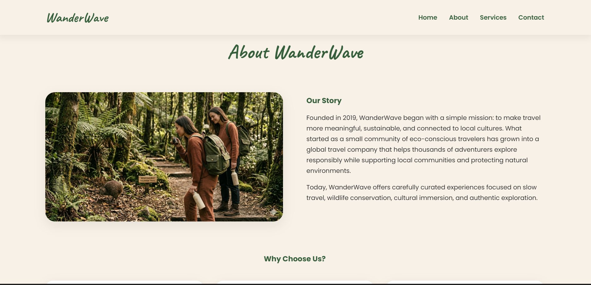 |
| About Section | 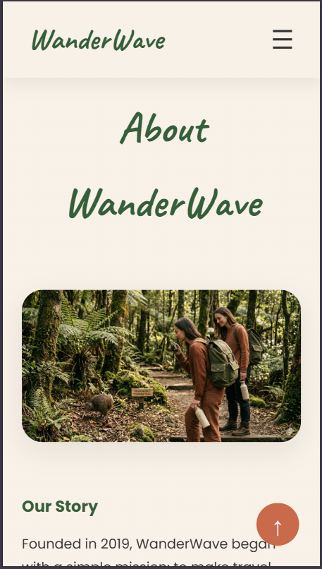 |
| About Section | 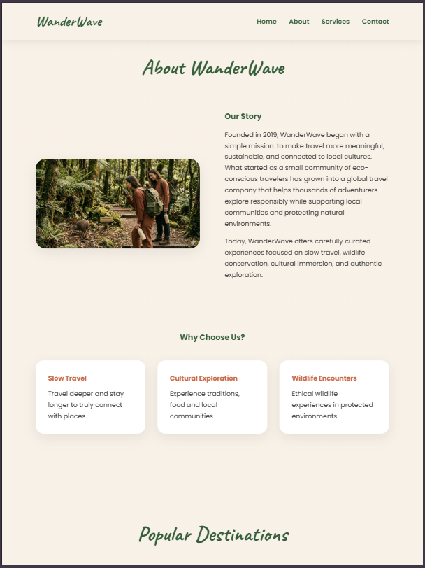 |
| Destinations  | 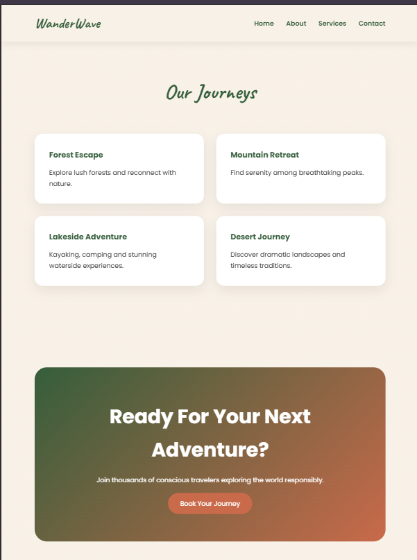|
| Services      | 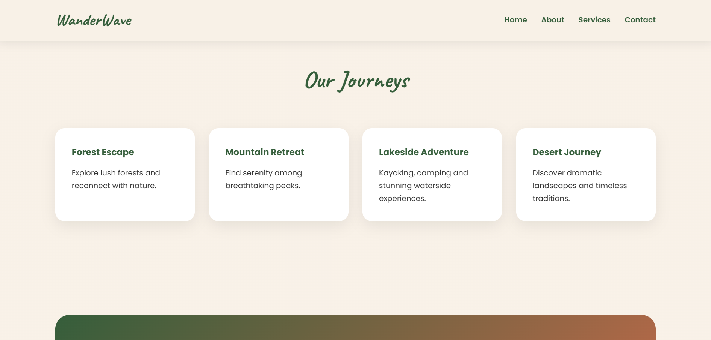 |
| Services      | 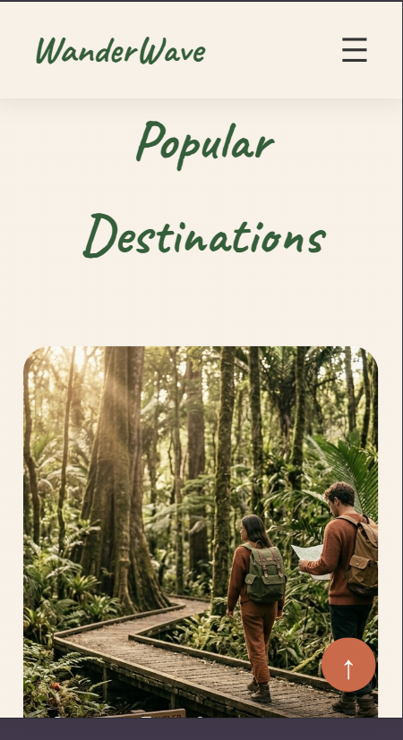 |
| Services      | 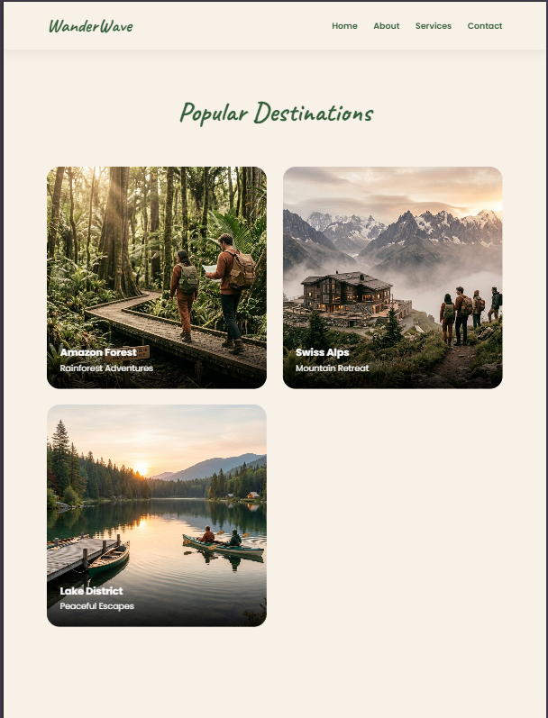 |
| Testimonials  | 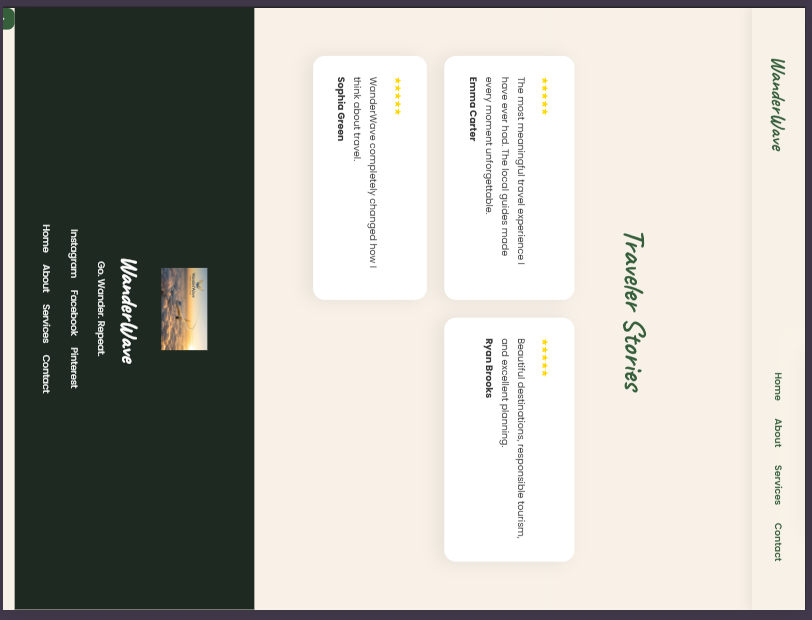|
| Contact Form  |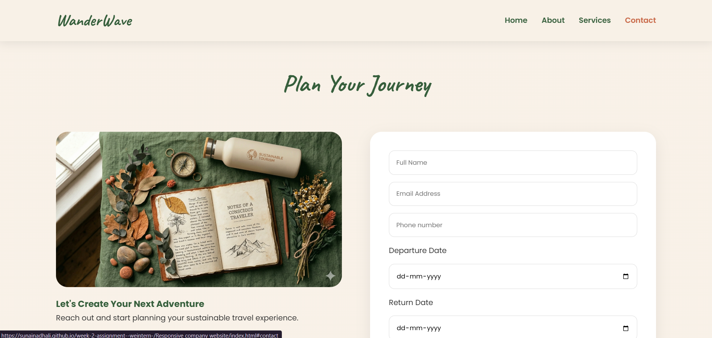 |
| Contact Form  | 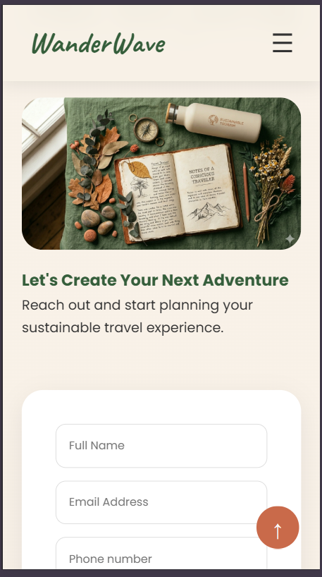 |
| Contact Form  |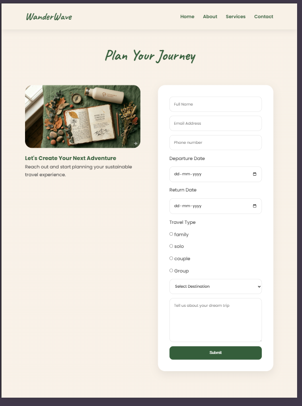 |

---

# Setup Instructions

### Clone Repository

```bash
git clone https://github.com/sunainadhali/week-2-assignment--weintern-.git
```

### Run Project

1. Clone the repository.
2. Open the project folder.
3. Launch `index.html` in any modern web browser.

No additional dependencies or build tools are required.

---

# Assignment Requirements Covered

✅ Responsive Company Website

✅ Home Section

✅ About Section

✅ Destinations Section

✅ Services Section

✅ Testimonials Section

✅ Contact Section

✅ Responsive Navigation Bar

✅ Mobile Hamburger Menu

✅ Professional Footer

✅ Semantic HTML5

✅ CSS Flexbox

✅ CSS Grid

✅ CSS Animations

✅ JavaScript Interactivity

✅ Form Validation

✅ Responsive Design

✅ Scroll Reveal Effects

✅ Animated Statistics Section

✅ Sustainable Travel Branding

---

# Learning Outcomes

This project strengthened my understanding of:

* Semantic HTML Structure
* Responsive Web Design
* CSS Flexbox
* CSS Grid
* Modern UI Design
* JavaScript DOM Manipulation
* Form Validation
* Animations and User Experience
* Professional Frontend Development Practices

---

# Author

**Sunaina Dhali**

GitHub: https://github.com/sunainadhali

---

*Submitted as part of the WeIntern Pvt Ltd Full Stack Development Internship – Week 2 (Task 1: Responsive Company Website).*
